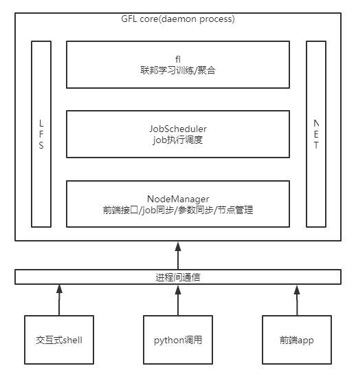

# GFL Framework
GFL is a federated learning framework based on pytorch and it provides different federated learning algorithm. GFL is also the infrastructure of Galaxy learning system(GLS). GLS is a federated learning system based on blockchain and GFL. At present, the GFL part is open-source first, and the blockchain part will be open-source soon. In addition to the traditional federate learning algorithm, GFL also provides a new federated learning algorithm based on model distillation. Developers can choose different federated learning algorithm to train their model.

## Base Framework Design

## Quick Start

+ Install `torch` && `torchvision`
+ Install `gfl`

