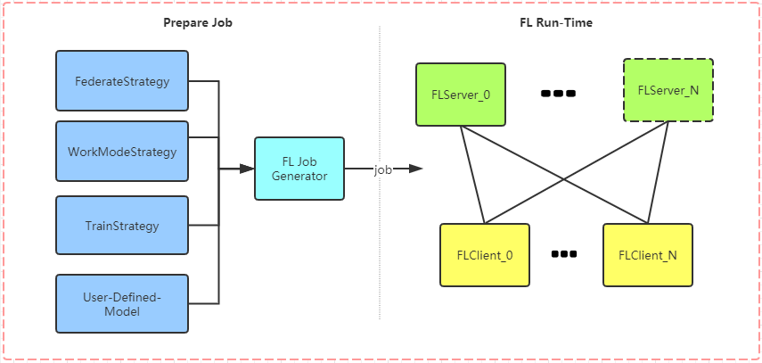

# PFL Framework

PFL is a federated learning framework based on pytorch and it provides different federated learning algorithm.
PFL is also the infrastructure of Galaxy learning system(GLS).
GLS is a federated learning system based on blockchain and PFL. 
At present, the PFL part is open-source first, and the blockchain part will be open-source soon. 
In addition to the traditional federate learning algorithm, PFL also provides a new federated learning algorithm 
based on model distillation. Developers can choose different federated learning algorithm to train their model.


## PFL Framework Design

> The framework design reference PaddleFL

**Prepare Job**
> When we want to use PFL, we need to specify several strategies and generate FL jobs.
- FederateStrategy: To specify federated learning algorithm(`FedAvg` or `Model Distillation`).
- WorkModeStrategy: To specify work mode(standalone or cluster).
- TrainStrategy: To specify train details in federated learning.
- User-Defined-Model: To specify the model in federated learning. 


**FL Run-Time**
> If we have prepared the FL job, we can use this job to start FL task. one FL client can 
>participate in multiple FL tasks and one FL client can communicate with multiple FL Servers
- FLServer: if we use `FedAvg` as our federated learning algorithm, then the FlServer is responsible for synchronizing
temporary model parameters from various FLClients and aggregating these model parameters from various FLClients each step.
if we use `Model Distillation` as our federated learning algorithm, the the FlServer is just responsible for synchronizing
temporary model parameters from various FLClients. 
- FLClient: The FLClient is responsible for training User-Defined-Model and commuticating with various FLServers. If we use 
`Model distillation` as our federated learning algorithm, then the FLClient is also responsible for model distillation.


## Install And Quick Start Guide

### Install PFL Framework
```python
pip install pfl >= 0.1.3
```
**Attention:** It's necessary to install pytorch and torchvison using conda in `macOS` to avoid the internal error of pytorch
installed by pip.
```python
conda install pytorch==1.3.0 torchvision==0.4.1 -c pytorch
```

**Dependent libraries**
```python
Werkzeug==0.16.0
requests==2.22.0
Flask==1.1.1
matplotlib==3.1.1
torch==1.3.0
torchvision==0.4.1
```
Attention: Make sure your `pillow<7.0.0`.


### Quick Start Guide

As a FLServer, we need to run fl_model.py to generate FL Job and then run fl_server.py.<br>
As a FLClient, we just need to run fl_client.py.
>FLClient can not search jobs automatically, beacuse we need to specify train strategy(optimizer/scheduler) for each model
>We need to restart fl_client.py manually when FLClient finished work last time.
#### Standalone work mode

fl_model.py
```python
from torch import nn
import torch.nn.functional as F
import pfl.core.strategy as strategy
from pfl.core.job_manager import JobManager


class Net(nn.Module):
    def __init__(self):
        super(Net, self).__init__()
        self.conv1 = nn.Conv2d(1, 20, 5, 1)
        self.conv2 = nn.Conv2d(20, 50, 5, 1)
        self.fc1 = nn.Linear(4 * 4 * 50, 500)
        self.fc2 = nn.Linear(500, 10)
        self.softmax = nn.Softmax(dim=1)

    def forward(self, x):
        x = F.relu(self.conv1(x))
        x = F.max_pool2d(x, 2, 2)
        x = F.relu(self.conv2(x))
        x = F.max_pool2d(x, 2, 2)
        x = x.view(-1, 4 * 4 * 50)
        x = F.relu(self.fc1(x))
        x = self.fc2(x)
        #need to return logits
        return x


if __name__ == "__main__":

    model = Net()

    job_manager = JobManager()
    job = job_manager.generate_job(work_mode=strategy.WorkModeStrategy.WORKMODE_STANDALONE,
                                   fed_strategy=strategy.FederateStrategy.FED_AVG, epoch=3, model=Net)
    job_manager.submit_job(job, model)

```
fl_client.py
```python
import torch
from torchvision import datasets, transforms
from pfl.core.client import FLClient
from pfl.core.strategy import WorkModeStrategy, TrainStrategy, LossStrategy
from pfl.core.trainer_controller import TrainerController

CLIENT_ID = 0

if __name__ == "__main__":
    # CLIENT_ID = int(sys.argv[1])

    mnist_data = datasets.MNIST("./mnist_data", download=True, train=True, transform=transforms.Compose([
        transforms.ToTensor(),
        transforms.Normalize((0.13066062,), (0.30810776,))
    ]))
    client = FLClient()
    pfl_models = client.get_remote_pfl_models()

    for pfl_model in pfl_models:
        optimizer = torch.optim.SGD(pfl_model.get_model().parameters(), lr=0.01, momentum=0.5)
        train_strategy = TrainStrategy(optimizer=optimizer, batch_size=32, loss_function=LossStrategy.NLL_LOSS)
        pfl_model.set_train_strategy(train_strategy)

    TrainerController(work_mode=WorkModeStrategy.WORKMODE_STANDALONE, models=pfl_models, data=mnist_data, client_id=CLIENT_ID,
                      curve=True, concurrent_num=3).start()


```

fl_server.py
```python
from pfl.core.server import FLStandaloneServer
from pfl.core.strategy import FederateStrategy

FEDERATE_STRATEGY = FederateStrategy.FED_AVG

if __name__ == "__main__":

    FLStandaloneServer(FEDERATE_STRATEGY).start()


```
#### Cluster work mode
> In cluster work mode we suggest you set FederateStrategy as `FederateStrategy.FED_AVG` in FLServer at `fl_server.py` to avoid some error in one situation which
> you both have FedAvg jobs and FedDistillation jobs, Because FLServer in FedDistillation work mode will not start an aggregator.
>   


fl_model.py

```python
from torch import nn
import torch.nn.functional as F
import pfl.core.strategy as strategy
from pfl.core.job_manager import JobManager


class Net(nn.Module):
    def __init__(self):
        super(Net, self).__init__()
        self.conv1 = nn.Conv2d(1, 20, 5, 1)
        self.conv2 = nn.Conv2d(20, 50, 5, 1)
        self.fc1 = nn.Linear(4 * 4 * 50, 500)
        self.fc2 = nn.Linear(500, 10)
        self.softmax = nn.Softmax(dim=1)

    def forward(self, x):
        x = F.relu(self.conv1(x))
        x = F.max_pool2d(x, 2, 2)
        x = F.relu(self.conv2(x))
        x = F.max_pool2d(x, 2, 2)
        x = x.view(-1, 4 * 4 * 50)
        x = F.relu(self.fc1(x))
        x = self.fc2(x)
        #need to return logits
        return x


if __name__ == "__main__":

    model = Net()
    job_manager = JobManager()
    job = job_manager.generate_job(work_mode=strategy.WorkModeStrategy.WORKMODE_CLUSTER,
                                   fed_strategy=strategy.FederateStrategy.FED_DISTILLATION, epoch=3, model=Net, distillation_alpha=0.5, l2_dist=True)
    job_manager.submit_job(job, model)


```
fl_client.py
```python
import torch
from pfl.core.client import FLClient
from torchvision import datasets, transforms
from pfl.core.trainer_controller import TrainerController
from pfl.core.strategy import WorkModeStrategy, TrainStrategy, LossStrategy

SERVER_URL = "http://127.0.0.1:9763"
CLIENT_IP = "127.0.0.1"
CLIENT_PORT = 8081
CLIENT_ID = 0


if __name__ == "__main__":
    mnist_data = datasets.MNIST("./mnist_data", download=True, train=True, transform=transforms.Compose([
        transforms.ToTensor(),
        transforms.Normalize((0.13066062,), (0.30810776,))
    ]))

    client = FLClient()
    pfl_models = client.get_remote_pfl_models(SERVER_URL)

    for pfl_model in pfl_models:
        optimizer = torch.optim.SGD(pfl_model.get_model().parameters(), lr=0.01, momentum=0.5)
        train_strategy = TrainStrategy(optimizer=optimizer, batch_size=32, loss_function=LossStrategy.NLL_LOSS)
        pfl_model.set_train_strategy(train_strategy)

    TrainerController(work_mode=WorkModeStrategy.WORKMODE_CLUSTER, models=pfl_models, data=mnist_data, client_id=CLIENT_ID,
                      client_ip=CLIENT_IP, client_port=CLIENT_PORT,
                      server_url=SERVER_URL, curve=True, concurrent_num=3).start()

```
fl_server.py
```python
from pfl.core.server import FLClusterServer
from pfl.core.strategy import FederateStrategy

FEDERATE_STRATEGY = FederateStrategy.FED_AVG
IP = '0.0.0.0'
PORT = 9763
API_VERSION = '/api/version'

if __name__ == "__main__":

    FLClusterServer(FEDERATE_STRATEGY, IP, PORT, API_VERSION).start()

```

