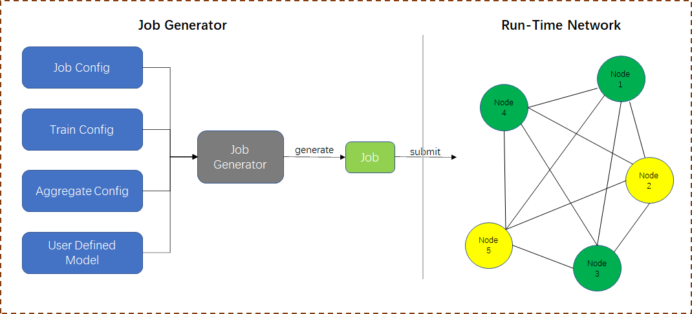
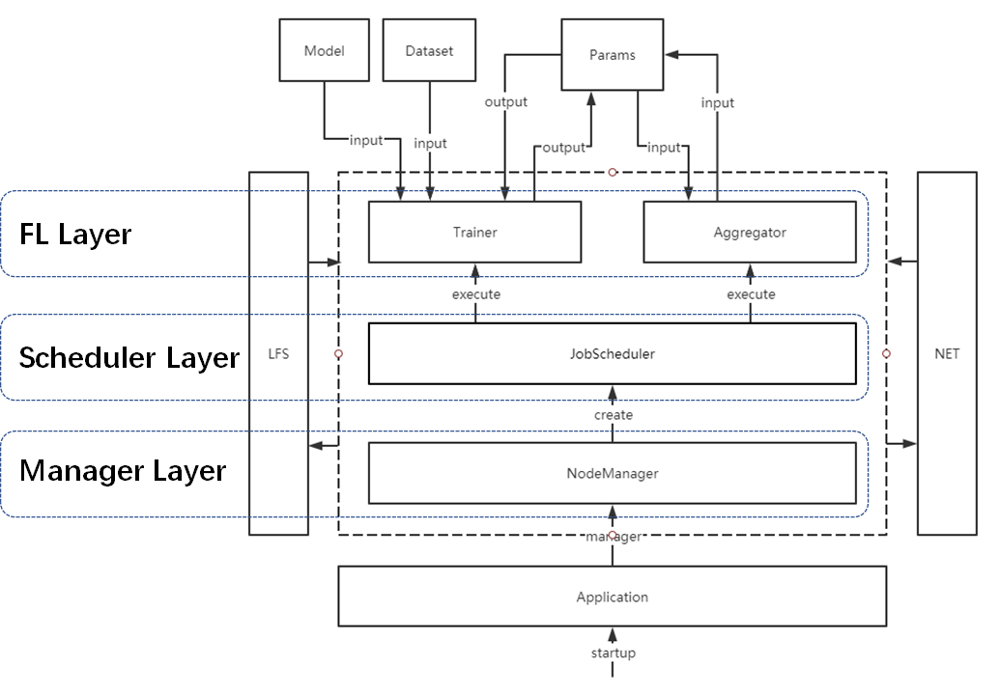

# GFL Framework

-------

[English](./README.md) | 简体中文

**Galaxy Federated Learning Framework(GFL)** 是一个基于区块链的去中心化联邦学习框架。GFL以Ethereum为基础建立去中心化通信网络，通过智能合约完成联邦学习中要求可信的关键功能。同时，GFL简化了联邦学习建模过程，让开发者可以快速建模和验证。

## 快速开始

### 1. 环境要求

a) GFL只支持Python3， 请确定你的Python版本不低于Python3.4。

b) GFL基于Pytorch实现模型训练，在使用GFL前需要安装`torch>=1.4.0`和`torchvision>=0.5.0`。[Pytorch安装教程](https://pytorch.org/get-started/locally/)

### 2. GFL安装

```shell
pip install gfl
```

### 3. GFL用法

GFL可用的命令。

```
usage: GFL [-h] {init,app,attach} ...

optional arguments:
  -h, --help         show this help message and exit

actions:
  {init,app,attach}
    init             init gfl env
    run              startup gfl
    attach           connect to gfl node
```

在datadir目录下初始化GFL节点。

```shell
python -m gfl init --home datadir
```

启动节点（默认以standalone模式启动），如果需要在启动节点的同时打开交互式命令行，使用`--console`参数。

```shell
python -m gfl run --home datadir
```

打开交互式命令行以对节点执行操作。以下三种方式都可以连接到上一步中启动的节点。

```
python -m gfl attach						# 默认连接http://localhost:9434
python -m gfl attach -H 127.0.0.1 -P 9434
python -m gfl attach --home datadir
```

## GFL基础设计



GFL框架分为两部分：

**Job Generator**

> *用于创建可以在GFL网络中执行的Job。开发者可以通过GFL提供的接口， 将各项配置参数生成一个Job分发到网络中以待训练。*

**Run-Time Network**

> *若干运行中的节点组成了GFL的去中心化训练网络， 每个GFL节点同时也是区块链中的一个节点。这些节点根据用户命令不停的处理网络中待训练的Job。*

## GFL核心框架结构



+ **Manager Layer**

  + 节点的启动/停止/状态探测
  + 提供节点的进程间通信接口
  + 同步Job

+ **Scheduler Layer**

  + 管理每个Job的执行流程
  + 在节点间同步参数文件
  + 调度节点上的多Job执行顺序

+ **FL Layer**

  + 配置Job的运行环境
  + 执行训练/聚合任务
  + 提供用户自定义动作接口
